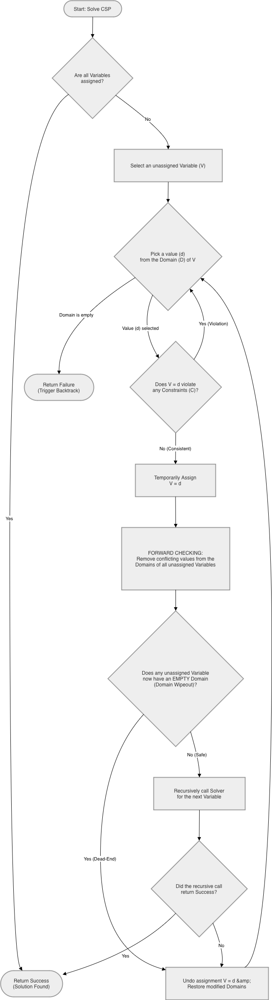

# Lookahead Constraint Solver

## Overview
This repository documents a conceptual algorithm developed from first principles while solving interconnected logic puzzles (specifically, the New York Times "PIP" game). Instead of relying on brute-force trial and error, this algorithm outlines an optimized approach to solving complex, interdependent systems by preventing invalid paths before they are fully explored.

## The Algorithm Concept
The core logic of the solver is broken down into three fundamental steps:

1. **Domain Initialization (Local Check):** For a starting location (Node 1), evaluate all available components (blocks/tiles). Filter out any component that violates the immediate local rules of Node 1 to create a list of valid candidates.

2. **Value Ordering Heuristic (Global Comparison):** For each valid candidate found in Step 1, evaluate its flexibility across the rest of the board. Count how many *other* nodes this specific component could potentially satisfy. 
   **The Assumption:** Select the component that satisfies the *least* number of other nodes as the primary choice for Node 1. The rationale is to use the most rigid, least flexible components first, preserving highly adaptable components for later stages where constraints are tighter.

3. **The Crucial Step (Look-Ahead / Forward Checking):** After making the assumption in Node 1, immediately perform a forward check across all remaining empty nodes. If the placement in Node 1 causes any other unassigned node to have zero valid solutions left, the assumption in Node 1 is immediately deemed invalid. The algorithm backtracks instantly, discarding the assumption before wasting computational power on subsequent, doomed steps.

**Flowchart**

## Computer Science Context
While formulated independently, this logic perfectly mirrors the architecture of an advanced Constraint Satisfaction Problem (CSP) solver:
* Step 1 aligns with **Domain Pruning**.
* Step 2 acts as a **Value Ordering Heuristic** (similar to Least Constraining Value logic).
* Step 3 is the exact definition of **Forward Checking**, a technique used to prevent algorithmic "thrashing" by predicting and avoiding dead-ends.

## Potential Real-World Applications
The constraint-solving principles defined here extend far beyond logic games and are highly applicable to complex engineering problems:

* **VLSI Routing and Physical Design:** In microelectronics, Electronic Design Automation (EDA) tools use similar constraint-based algorithms to route connections across silicon. Look-ahead mechanisms ensure that routing a wire in one area does not block the only available path for another crucial signal, preventing costly layout redesigns.
* **Formal Verification:** Proving mathematically that complex digital logic systems or communication protocols will not enter deadlock states under any combination of inputs.
* **Automated Scheduling & Allocation:** Optimizing resource distribution where multiple strict conditions (time, location, dependencies) must be met simultaneously without conflict.

## Future Work
- [ ] Develop a Jupyter Notebook to visualize the algorithm.
- [ ] Write the Python implementation of the solver.
- [ ] Create visual decision trees to illustrate the Forward Checking mechanism in action.
